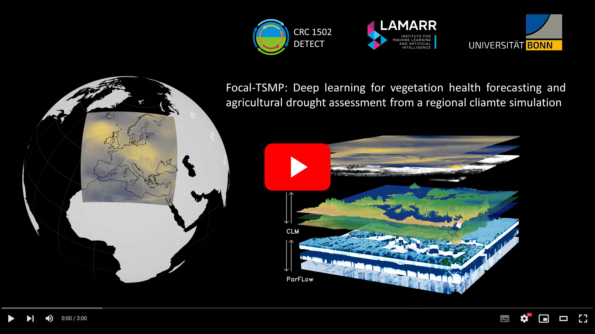
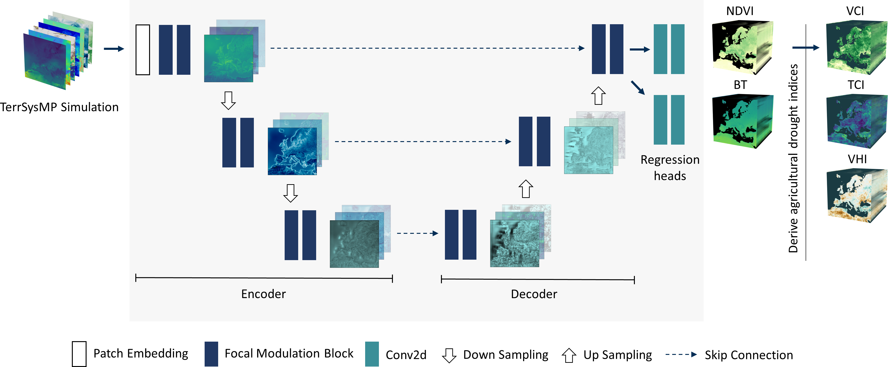

# Focal_TSMP

This is the code to reproduce the results presented in the paper: 

["**Focal-TSMP: deep learning for vegetation health prediction and agricultural drought assessment from a regional climate simulation**"](https://doi.org/10.5194/gmd-17-2987-2024) by [Mohamad Hakam Shams Eddin](https://hakamshams.github.io/), and [Juergen Gall](http://pages.iai.uni-bonn.de/gall_juergen/). Published in [Geoscientific Model Development](https://www.geoscientific-model-development.net/).

Computer Vision Group, Institue of Computer Science, University of Bonn.

### [Project Page](https://hakamshams.github.io/Focal-TSMP/) | [Paper](https://doi.org/10.5194/gmd-17-2987-2024)

[](https://www.youtube.com/watch?v=7m-85sDGwe8)

<br />

## Model architecture



<br />

## Setup

For conda, you can install dependencies using yml file:
```
  conda env create -f Focal_TSMP.yml
```

## Code

The code has been tested under Pytorch 1.12.1 and Python 3.10.6 on Ubuntu 20.04.5 LTS with NVIDIA RTX A6000 GPUs and NVIDIA GeForce RTX 3090 GPU.

The configuration file:
```
  config.py
```

The dataloader for TSMP dataset:
```
  TerrSysMP_NET_dataset.py
```
For training:
```
  train.py
```
For testing:
```
  test.py
```
<br />

## Dataset

To train on TSMP dataset:
- You have to download the preprocessed remote sensing data into the directoy [data](data) from [https://zenodo.org/doi/10.5281/zenodo.10008814](https://zenodo.org/doi/10.5281/zenodo.10008814) (~6GB).
- Download the [TSMP simulation](https://datapub.fz-juelich.de/slts/cordex/index.html) (~900GB) from Juelich Research Centre into the directory [data/TerrSysMP](data/TerrSysMP). You can use the script [download_data_Juelich.py](preprocessing/download_data_Juelich.py)
- Generate the dataset TerrSysMP_NET using the script [generate_TerrSysMP_NET.py](preprocessing/generate_TerrSysMP_NET.py). 

    The file (generate_TerrSysMP_NET.py) is hard coded for this specific dataset and not ment to be a generic script for preprocessing.

To train on another dataset, you need to create a new dataloader class like [TerrSysMP_NET_dataset.py](TerrSysMP_NET_dataset.py)

## Checkpoints

Pretrained models can be downloaded from [https://zenodo.org/doi/10.5281/zenodo.10015048](https://zenodo.org/doi/10.5281/zenodo.10015048)


### Citation
If you find our work useful in your research, please cite:

```

@Article{gmd-17-2987-2024,
AUTHOR = {Shams Eddin, M. H. and Gall, J.},
TITLE = {Focal-TSMP: deep learning for vegetation health prediction and agricultural drought assessment from a regional climate simulation},
JOURNAL = {Geoscientific Model Development},
VOLUME = {17},
YEAR = {2024},
NUMBER = {7},
PAGES = {2987--3023},
URL = {https://gmd.copernicus.org/articles/17/2987/2024/},
DOI = {10.5194/gmd-17-2987-2024}
}

```

### Acknowledgments

This work was funded by the Deutsche Forschungsgemeinschaft (DFG, German Research Foundation) within the Collaborative Research Centre SFB 1502/1–2022 - [DETECT](https://sfb1502.de/) - [D05](https://sfb1502.de/projects/cluster-d/d05) and under Germany’s Excellence Strategy – EXC 2070– project no. 390732324.

### License
The code is released under MIT License. See the [LICENSE](LICENSE) file for details.
